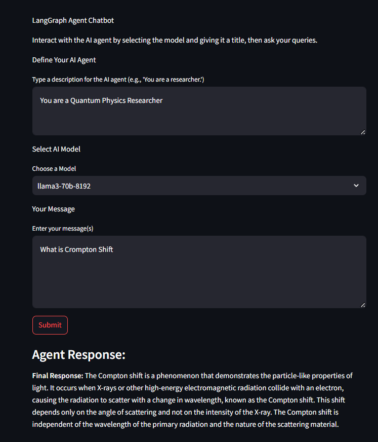

# CHATBOT
## What is a Agent
An AI agent refers to a system or program that is designed to autonomously perform tasks or make decisions based on input from its environment, typically using artificial intelligence (AI) techniques such as machine learning, natural language processing, and problem-solving algorithms.

## Why Personalized Agent
### 1. Improved User Experience: 
Personalization allows the agent to adjust its tone, language, and complexity to better align with the user's needs, whether they require detailed technical explanations or simple responses.
### 2. Tailored Interactions: 
A personalized AI agent adapts its responses based on the unique needs, preferences, and context of the user. This enhances user experience by providing relevant and meaningful interactions.
### 3. Context Awareness: 
Unlike generic agents, personalized agents can remember past interactions and user-specific details, which helps in providing more accurate and effective solutions.
### 4. Efficiency in Problem Solving: 
In specific domains, like customer service or research, personalized agents can be equipped with domain-specific knowledge to provide quicker, more relevant answers.

## Why Use Groq API
### Accelerating deep learning workloads by utilizing GROQ hardware.
### Simplifying deployment and integration of AI models at scale.
### Improving real-time performance with low latency and high throughput.
### Reducing power consumption while maintaining high inference speeds.

## Why Use Tavily API
### Real-time indexing ensures the latest data is always available.
### High-speed performance for fast search results, even with large datasets.
### Scalable to handle increased data volumes and traffic.
### Customizable search features and advanced filtering for personalized search experiences.
### NLP capabilities for understanding natural language queries.
### Easy to integrate and cost-effective to deploy.

## How To Run This:
  ### *Run the server:-uvicorn application:application --host 127.0.0.1 --port 8000   ||application can be replaced if you change the application.py name
  ### *Run the user-interface.py:streamlit run interface.py ||interface.py can be replaced if you change the interface.py name

## References
### https://github.com/balupeddireddy08/End-to-End-AI-Chatbot-with-Langraph-FastAPI-and-Streamlit-UI/tree/main
